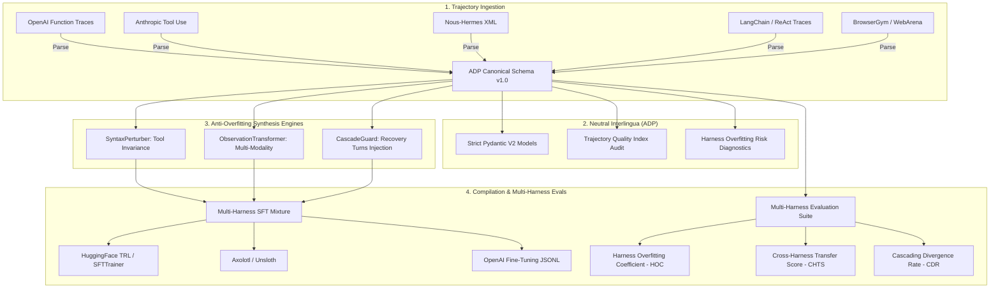

# PolyHarness

**The Open-Standard Trajectory Interlingua (ADP) & Multi-Harness Evaluation Suite for Agentic Fine-Tuning**

[](https://github.com/shahriar-ahmed-seam/polyharness/actions/workflows/ci.yml)
[](https://www.python.org/)
[](https://opensource.org/licenses/Apache-2.0)
[](#agent-data-protocol-adp-v10)
[](#docker-quickstart)

---

## Motivation: Why 1-Harness Fine-Tuning Collapses in Production

When enterprise teams train autonomous agents using Supervised Fine-Tuning (SFT) on trajectory recordings, they typically collect data inside **one specific framework** (e.g. OpenAI function calling, LangChain ReAct, or BrowserGym). 

When deployed to production, these models suffer catastrophic failure. Teams often try to *"tweak the prompt and add more examples"*, which **treats a data problem as a prompt problem**.

```
    ┌────────────────────────────────────────┐
    │  Tweak the prompt & add more examples  │ [Antipattern: treats data problem as prompt problem]
    └────────────────────────────────────────┘
                       ▲
   ┌───────────────────┴────────────────────┐
   │ Harness Overfitting: Trajectory, Not Task│
   └───────┬──────────────┬──────────────┬──┘
           │              │              │
           ▼              ▼              ▼
   ┌──────────────┐ ┌──────────────┐ ┌──────────────┐
   │ Tool Syntax  │ │ Observation  │ │Teacher       │
   │ & Primitives │ │ Format       │ │Forcing       │
   │ [Syntax]     │ │ [Modality]   │ │Cascade       │
   └───────┬──────┘ └──────┬───────┘ └──────┬───────┘
           │               │                │
           └───────────────┼────────────────┘
                           ▼
   ┌────────────────────────────────────────────────────────┐
   │ Data Fix: Neutral Storage & Multi-Harness Evaluations  │
   │ • Use neutral interlingua schema (Agent Data Protocol) │
   │ • Render across multiple harnesses & evaluate unseen   │
   └────────────────────────────────────────────────────────┘
```

### The 3 Production Realities:
1. **SFT copies recordings, not generic logic.** The weights memorize the exact syntactic token sequences of the recording environment.
2. **Single-harness training guarantees overfitting.** Training exclusively on one tool schema or DOM serialization creates fragile agents incapable of generalizing.
3. **Off-distribution errors compound rapidly.** Because SFT trains with teacher forcing on 100% clean trajectories, the first unfamiliar observation derails the model into compounding errors.

### The 3 Whiteboard Failure Modes Solved by PolyHarness:
| Failure Mode | Production Manifestation | PolyHarness Solution |
| :--- | :--- | :--- |
| **1. Tool Syntax & Primitives** | Different schemas or tool names cause malformed JSON calls and missed actions. | **`SyntaxPerturber`**: Generates parameter casing invariance (camelCase vs snake_case) and schema perturbations. |
| **2. Observation Format** | Unseen HTML, raw text, or tree formats force the model onto unvisited states. | **`ObservationTransformer`**: Synthesizes concurrent views (DOM HTML, AXTree, Markdown, JSON state). |
| **3. Teacher Forcing Cascade** | First unfamiliar state pushes model off-distribution; errors compound turn-by-turn. | **`CascadeGuard`**: Injects simulated failures and self-correction recovery turns directly into SFT datasets. |

---

## Architecture Overview




---

## Key Features

- **Agent Data Protocol (ADP v1.0)**: Strict, open-standard Pydantic V2 specification decoupling task goals, environment specifications, tool schemas, and observations from framework quirks.
- **7 Production Harness Adapters**:
  - `openai`: ChatML and standard JSON function calling (`tools` array).
  - `anthropic`: Claude 3.5/3.7 content blocks (`tool_use` and `tool_result`).
  - `hermes`: Nous-Hermes 2/3 XML format (`<tools>`, `<tool_call>`, `<tool_response>`).
  - `react`: Classic ReAct reasoning loop (`Thought:` / `Action:` / `Observation:`).
  - `browsergym`: Web agent action space (`click`, `fill`, `scroll`) and accessibility trees.
  - `langchain`: AgentExecutor trace export and intermediate steps.
  - `smolagents`: HuggingFace CodeAgent & ToolCallingAgent Pythonic syntax.

- **Anti-Overfitting Synthesis Engine**:
  - **`SyntaxPerturber`**: Inoculates models against tool schema fragility.
  - **`ObservationTransformer`**: Decouples models from DOM lock-in with HTML ⇄ AXTree ⇄ Markdown converters.
  - **`CascadeGuard`**: Fixes teacher-forcing fragility by synthesizing self-correction recovery turns.
- **Multi-Harness Evaluation Suite**:
  - Computes the **Harness Overfitting Coefficient (HOC)**:
    $$\text{HOC} = \frac{\text{Native Accuracy} - \text{Unseen Harnesses Average Accuracy}}{\text{Native Accuracy}}$$
  - Computes **Cross-Harness Transfer Score (CHTS)** and **Cascading Divergence Rate (CDR)**.
- **Interactive PolyHarness Web Studio**:
  - Modern dark-themed dashboard for visual side-by-side trajectory translation, whiteboard risk diagnostics, live synthesis, and eval matrices.
- **Production CLI & DevOps**:
  - Full Typer CLI toolchain (`polyharness info`, `validate`, `render`, `augment`, `compile`, `eval`, `serve`).
  - Docker & Docker Compose deployment with automated multi-version CI workflows.

---

## Quickstart


### 1. Installation

```bash
# Clone the repository
git clone https://github.com/shahriar-ahmed-seam/polyharness.git
cd polyharness

# Create and activate virtual environment
python3 -m venv .venv
source .venv/bin/activate

# Install with development dependencies
pip install --upgrade pip
pip install -e ".[dev]"
```

---

### 2. Command Line Interface (CLI)

```bash
# View system status and registered adapters
polyharness info

# Validate an ADP trajectory and calculate whiteboard overfitting risk
polyharness validate examples/trajectories/web_ecommerce_search.json

# Render an ADP trajectory into a target harness format
polyharness render examples/trajectories/web_ecommerce_search.json --harness hermes

# Generate anti-overfitting synthetic variants (Syntax, Modality, Recovery)
polyharness augment examples/trajectories/web_ecommerce_search.json --output augmented_data/

# Compile an SFT mixture dataset for fine-tuning
polyharness compile examples/trajectories/web_ecommerce_search.json --mixture --output exported_sft/train.jsonl

# Run a Multi-Harness Overfitting Audit
polyharness eval --profile overfitted_single_harness
polyharness eval --profile polyharness_generalist

# Launch the Web Studio UI and REST API
polyharness serve --port 8000
```

---

### 3. Python SDK Usage

#### Loading & Translating Trajectories Across Harnesses
```python
from polyharness.schema.serialization import load_trajectory
from polyharness.adapters import get_adapter

# Load canonical ADP trajectory
traj = load_trajectory("examples/trajectories/web_ecommerce_search.json")

# Render to OpenAI Function Calling
openai_adapter = get_adapter("openai")
openai_payload = openai_adapter.render(traj)

# Render to Nous-Hermes XML
hermes_adapter = get_adapter("hermes")
hermes_payload = hermes_adapter.render(traj)

# Render to Anthropic Claude Tool Use
claude_adapter = get_adapter("anthropic")
claude_payload = claude_adapter.render(traj)
```

#### Mitigating Teacher Forcing with CascadeGuard
```python
from polyharness.synthesis.cascade_guard import CascadeGuard

guard = CascadeGuard(seed=42)

# Injects realistic failure and self-correction recovery turns
guarded_traj = guard.inject_recovery_turn(traj)

print(f"Original steps: {len(traj.steps)} -> Guarded steps: {len(guarded_traj.steps)}")
print(f"Recovery turns: {guarded_traj.recovery_turn_count()}")
```

#### Multi-Harness SFT Dataset Compilation
```python
from polyharness.synthesis.compiler import DatasetCompiler

compiler = DatasetCompiler(seed=42)

# Compile a multi-harness mixture dataset to prevent harness lock-in
mixture_records = compiler.compile_multi_harness_mixture(
    [traj],
    harness_distribution={
        "openai": 0.35,
        "hermes": 0.30,
        "anthropic": 0.20,
        "react": 0.15,
    }
)

compiler.export_to_file(mixture_records, "exported_sft/train.jsonl")
```

---

## Benchmark Results

When evaluated on the standardized benchmark suite:

```
                  Whiteboard Overfitting Resolution Benchmark                   
┏━━━━━━━━━━━━━━━━━━━━━━━━━┳━━━━━━━━━━━━━━━━━━━━━━━━━┳━━━━━━━━━━━━━━━━━━━━━━━━━━┓
┃ Metric                  ┃ 1-Harness Fine-Tuned    ┃ PolyHarness Trained      ┃
┃                         ┃ Model                   ┃ Model                    ┃
┡━━━━━━━━━━━━━━━━━━━━━━━━━╇━━━━━━━━━━━━━━━━━━━━━━━━━╇━━━━━━━━━━━━━━━━━━━━━━━━━━┩
│ Harness Overfitting     │ 1.000 (Severe Collapse) │ 0.000 (Invariant)        │
│ Coefficient (HOC)       │                         │                          │
│ Cross-Harness Transfer  │ 0.000                   │ 1.000                    │
│ Score (CHTS)            │                         │                          │
│ Cascading Divergence    │ 0.250                   │ 0.000                    │
│ Rate (CDR)              │                         │                          │
│ Production Status       │ FAILED IN PRODUCTION    │ CERTIFIED FOR PRODUCTION │
│ Verdict                 │                         │                          │
└─────────────────────────┴─────────────────────────┴──────────────────────────┘
```

---

## Docker Quickstart

Launch the entire PolyHarness Studio service in an isolated container:

```bash
docker compose up -d
```

Visit the Web Studio at [http://localhost:8000](http://localhost:8000) or check API docs at [http://localhost:8000/docs](http://localhost:8000/docs).

---

## Testing


Run the test suite with coverage:

```bash
pytest -v tests/
```

Run code formatting and linting:

```bash
ruff check src tests examples
```

---

## Project Structure

```
Harness/
├── src/
│   └── polyharness/
│       ├── schema/              # Neutral Interlingua (Agent Data Protocol - ADP v1.0)
│       │   ├── adp.py           # Core Pydantic V2 models
│       │   ├── validator.py     # Trajectory validator & whiteboard diagnostics
│       │   ├── parsing.py       # Resilient JSON & ID reconciliation utilities
│       │   └── serialization.py # JSON/JSONL serialization utilities
│       ├── adapters/            # 7 Bidirectional Harness Adapters
│       │   ├── base.py          # Abstract Base Adapter
│       │   ├── openai.py        # OpenAI ChatML adapter
│       │   ├── anthropic.py     # Claude Tool Use adapter
│       │   ├── hermes.py        # Nous Hermes XML adapter
│       │   ├── react.py         # Classic ReAct adapter
│       │   ├── browsergym.py    # BrowserGym web agent adapter
│       │   ├── langchain.py     # LangChain trace adapter
│       │   └── smolagents.py    # HuggingFace Smolagents adapter

│       ├── synthesis/           # Anti-Overfitting Engines
│       │   ├── perturbation.py  # Tool syntax & schema noise injection
│       │   ├── observation.py   # DOM ⇄ AXTree ⇄ Markdown ⇄ JSON transforms
│       │   ├── cascade_guard.py # Recovery turn injection (Teacher forcing mitigation)
│       │   └── compiler.py      # SFT dataset compiler (TRL, Axolotl, Unsloth, OpenAI)
│       ├── eval/                # Multi-Harness Evaluation Suite
│       │   ├── metrics.py       # HOC, CHTS, and CDR metric formulas
│       │   ├── runner.py        # Multi-harness evaluation runner & providers
│       │   └── benchmarks.py    # Curated standard benchmark tasks
│       ├── server/              # FastAPI Server & Embedded Web Studio
│       │   ├── app.py           # FastAPI application
│       │   ├── routes.py        # REST API endpoints
│       │   └── static/          # Embedded Web Studio assets (HTML, CSS, JS)
├── docs/
│   ├── ARCHITECTURE.md          # Formal system architecture blueprint
│   ├── SPECIFICATION.md         # Agent Data Protocol (ADP v1.0) specification
│   └── BENCHMARKS.md            # Multi-harness evaluation metrics & methodology
├── examples/
│   ├── trajectories/            # Standard ADP trajectory samples
│   ├── compile_multi_harness.py # SFT compilation script
│   ├── run_eval_audit.py        # Multi-harness audit script
│   └── augment_dataset.py       # Dataset augmentation script
├── tests/                       # Complete automated pytest suite
├── Dockerfile                   # Multi-stage production container
├── docker-compose.yml           # Compose specification
├── pyproject.toml               # Package configuration
├── README.md                    # Product documentation
├── CONTRIBUTING.md              # Contribution guide
├── LICENSE                      # Apache 2.0 license
├── CHANGELOG.md                 # Version release history
├── SECURITY.md                  # Security vulnerability disclosures
└── CITATION.cff                 # Academic & engineering citation
```

---

## Technical Documentation

- **[System Architecture Blueprint](docs/ARCHITECTURE.md)**: Deep dive into the canonical interlingua pipeline, AST DOM compaction, and streaming compilation mechanics.
- **[Agent Data Protocol (ADP v1.0) Specification](docs/SPECIFICATION.md)**: Formal RFC specification defining schemas, invariants, step indexing, and multimodal observation formats.
- **[Multi-Harness Evaluation & Benchmarks](docs/BENCHMARKS.md)**: Mathematical formulations of HOC, CHTS, CDR metrics and 95% bootstrap confidence bounds.

---

## Citation

If you use **PolyHarness** in your research or production agent pipelines, please cite:

```bibtex
@software{polyharness2026,
  author = {Seam, Shahriar Ahmed},
  title = {PolyHarness: The Open-Standard Trajectory Interlingua (ADP) & Multi-Harness Evaluation Suite for Agentic Fine-Tuning},
  url = {https://github.com/shahriar-ahmed-seam/polyharness},
  year = {2026}
}
```

---

## License

PolyHarness is licensed under the [Apache License 2.0](LICENSE).

